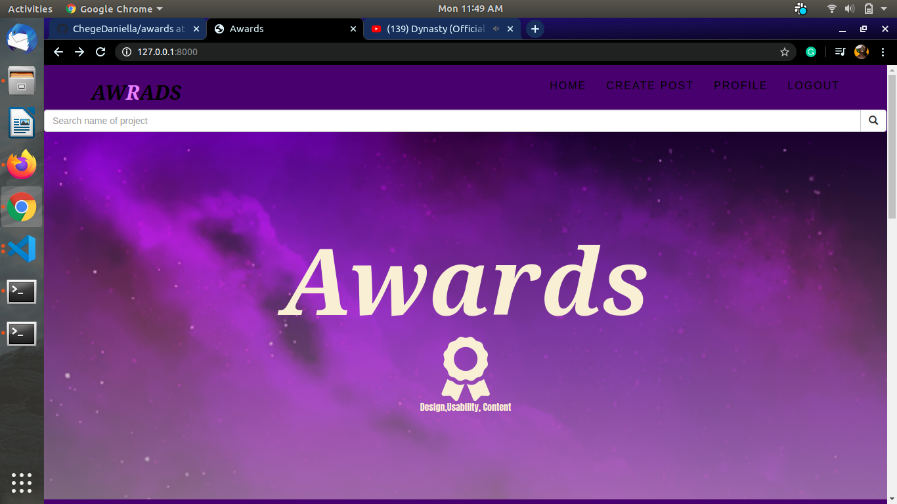

# Awards

This application gives a user and a viwere a chance to look at other peoples websites and be able to rate them.A user has to be loged in for them to create a post and be able to edit the post they created


## Getting started

You can be able to clone and run the application on your local machine.

[Press here to clone](https://github.com/ChegeDaniella/awards.git)

### Prerequisites

Some of the thngs and extensions you will need to download so that your application can be able to run locally are

```
Python
Django
Django-bootstrap3
pylint
psycopg2
pillow
django-registration
django-crispy-forms
```

### Installing

You can be able to install and run this application through the following process:
Since the cloned code will be in production you first have to change the DEBUG in env to TRUE

```
DEBUG=TRUE
```

Then you should create an enviroment in your folder which will be able to hold all the extensions yoou are going to be adding
The commands for this are:

```shell script
python3 -m venv --without-pip virtual
curl https://bootstrap.pypa.io/get-pip.py | python
source virtual/bin/activate
```

Ensure that you have installed all the extensions mentioned above in the enviroment.

After installation the application should be able to render from the local host.On the terminal run command



```
python3.6 manage.py runserver
```

Then click on the http://127.0.0.1:8000 to be able to view your project in the browser

## Live link

 https://awardscopy.herokuapp.com/

## Running Test

As this is a python application we have tests.To be able to run the tests run the following command in your terminal

```
python3.6 manage.py test
```

### Breaking down the tests

We run tests to ensure that the of the functions and models we use are doing what they are meant to do.

In the application we have 3 class test models which go hand in hand with the models in our database.Each model has a save test function.An example

```
        def test_save_post(self):
            self.new_user.save()
            self.new_post.save_posts()
            post = Posts.objects.all()
            self.assertTrue(len(post)>0)    
```

This test is for testing whether a post has been saved.

## Built with 
* [Python](https://docs.python.org/release/3.6.9/tutorial/index.html) This is the language used
* [Django](https://docs.djangoproject.com/en/3.0/) The web framework used
* [SQLprogest](https://docs.djangoproject.com/en/3.0/topics/db/sql/) The database that has been used.The link is specific to the django frame work.

## Author

Daniella Wangechi chege

## Lisence

[Lisence](/License)